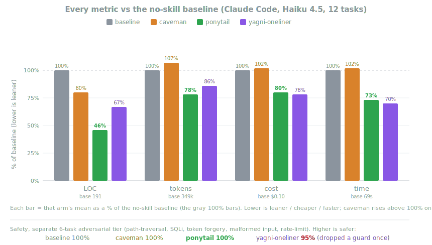
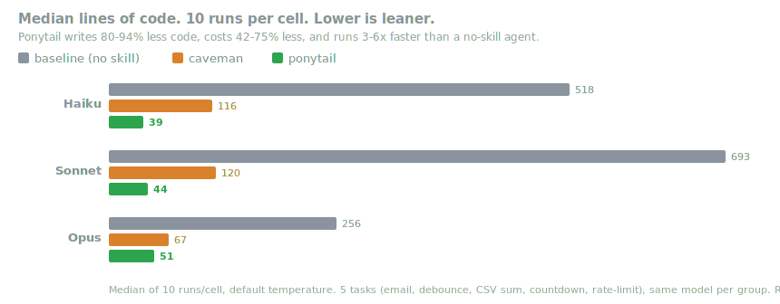

<p align="center">
  <picture>
    <source media="(prefers-color-scheme: dark)" srcset="assets/logo-dark.png">
    
  </picture>
</p>

<h1 align="center">Ponytail</h1>

<p align="center">
  <em>不說話。寫一行。就能跑。</em>
</p>

<p align="center">
  
  
  
  
  
</p>

<p align="center">
  <a href="https://trendshift.io/repositories/50668" target="_blank" rel="noopener noreferrer"></a>
  <a href="https://trendshift.io/repositories/50668" target="_blank" rel="noopener noreferrer"></a>
</p>

<p align="center">
  <strong>程式碼少約 54%（最高 94%）&middot; 成本低約 20% &middot; 速度快約 27% &middot; 100% 安全</strong><br>
  <sub>在真實的 Claude Code 工作階段中，讓同一個代理編輯真實的開源倉庫（FastAPI + React），分別啟用與不啟用此 skill 後測得。約 54% 是 12 個功能任務的平均值（Haiku 4.5，n=4）；在代理很容易過度建構的情境（例如日期選擇器）可達 94%，而本來就已精簡的程式碼則幾乎沒有差異。ponytail 保留了每一項安全防護；只要求「寫單行程式碼」的提示詞則會漏掉其中一項。（早期單次 benchmark 將 80–94% 寫成統一數字；與公平的代理基線相比，那是每個任務的上限，不是平均值。）<a href="benchmarks/results/2026-06-18-agentic.md">完整報告</a> &middot; <a href="benchmarks/">重現方法</a>。</sub>
</p>

<p align="center">
  <sub>社群翻譯。<a href="README.md">英文 README</a> 是基準且保持最新的版本。</sub>
</p>

---

你一定見過這種人：長馬尾、橢圓眼鏡，比版本控制系統還早進公司。你遞給他五十行程式碼；他看一眼，不說話，直接換成一行。

Ponytail 把他放進你的 AI 代理裡。

## 前後對照

你要一個日期選擇器。代理裝上 flatpickr，寫一個包裝元件，加一份樣式表，然後開始討論時區。

有了 ponytail：

```html
<!-- ponytail: browser has one -->
<input type="date">
```

更多倖存案例見 [examples/](examples/)。

## 數據

最誠實的衡量方式，是讓真實代理做真實工作：讓無頭 Claude Code 工作階段編輯 [tiangolo 的 full-stack-fastapi-template](https://github.com/fastapi/full-stack-fastapi-template)（一個真實的 FastAPI + React 倉庫），依它留下的 `git diff` 評分。12 個功能任務，同一個代理分別啟用與不啟用 skill，n=4，Haiku 4.5。

<p align="center">
  
</p>

| 相對無 skill 基線 | LOC | token | 成本 | 耗時 | 安全 |
|---|--:|--:|--:|--:|--:|
| **ponytail** | **-54%** | **-22%** | **-20%** | **-27%** | **100%** |
| caveman（簡短表述對照組） | -20% | +7% | +3% | +2% | 100% |
| 「YAGNI + 單行程式碼」提示詞 | -33% | -14% | -21% | -30% | 95% |

ponytail 是唯一同時降低每項指標、又維持完整安全性的方案。降幅最大的地方，正是容易過度建構的情境：它會優先用原生 `<input>`，而不是元件，所以日期選擇器從 404 行縮到 23 行，顏色選擇器從 287 行縮到 23 行；對已經足夠精簡的程式碼，變化則接近零。完整方法、逐任務表格與限制說明見 [benchmarks/results/2026-06-18-agentic.md](benchmarks/results/2026-06-18-agentic.md)。

<details>
<summary><strong>較早的單次數據（獨立生成）</strong></summary>

五個日常任務、三個模型、三個方案（無 skill、[caveman](https://github.com/JuliusBrussee/caveman)、ponytail），每項執行十次，報告中位數。一個提示詞，一次回答，計算回答中的程式碼行數：

<p align="center">
  
</p>

結果顯示**程式碼減少 80–94%**。但正如 [#126](https://github.com/DietrichGebert/ponytail/issues/126) 合理指出的，無 skill 的基線模型會用說明與選項填充回答，因此其中一部分差距只是對話式基線造成的假象。上面的代理數據才是修正後、站得住腳的版本。可用 `npx promptfoo eval -c benchmarks/promptfooconfig.yaml` 重現單次執行。

</details>

**這條規則從來不是「token 越少越好」。** 它是：只寫任務真正需要的東西，絕不砍掉驗證、錯誤處理、安全性或無障礙支援。程式碼之所以變少，是因為只留下必要部分，不是為了炫技。對遵循這套階梯的模型而言，更低的成本與延遲只是副產品；一個為逐級斟酌而消耗大量思考 token 的簡潔推理模型反而可能更慢、更貴（GPT-5.5 就是如此）。

## 運作方式

寫程式碼前，代理會在第一個成立的層級停下：

```
1. 這東西有必要存在嗎？       → 沒必要：跳過（YAGNI）
2. 現有程式碼庫裡已經有了嗎？    → 重用，別重寫
3. 標準函式庫能做嗎？          → 用標準函式庫
4. 原生平台功能能做嗎？        → 用原生功能
5. 已安裝的相依套件能解決嗎？  → 用現有相依套件
6. 一行能搞定嗎？              → 一行
7. 最後才是：寫出能運作的最小實作
```

這套階梯是在理解問題*之後*才運作，不是用來取代理解：先讀會被改到的程式碼，追完真實流程，再選層級。方案可以懶，閱讀絕不能懶。

懶，不等於疏忽：信任邊界的驗證、防止資料遺失的處理、安全性與無障礙支援，絕不在刪減之列。

## 安裝

這是 ponytail 這輩子會要求你付出的最大努力：

Claude Code 與 Codex 外掛會執行兩個很小的 Node.js 生命週期 hook，因此 `node` 必須在你的 PATH 中（Nix/nvm 使用者注意：它必須出現在非互動 shell 的 PATH 中）。如果不在，skills 仍然可用；只是原本常駐的自動啟用會保持安靜，而不會每個提示詞都報錯。

### Claude Code

```
/plugin marketplace add DietrichGebert/ponytail
```
```
/plugin install ponytail@ponytail
```
（必須分兩次送出提示詞，安裝才會成功）

桌面應用程式沒有 `/plugin` 指令，請從 UI 安裝：Customize、個人外掛旁的 +、Create plugin and add marketplace、Add from repository，然後輸入倉庫 URL（感謝 @NiklasDHahn，#98）。

### Codex

```bash
codex plugin marketplace add DietrichGebert/ponytail
codex
```

開啟 `/plugins`，選擇 Ponytail marketplace 並安裝 Ponytail。接著開啟 `/hooks`，審核並信任它的兩個生命週期 hook，再開始新的執行緒。

這次安裝同樣涵蓋 Codex 桌面應用程式：安裝後重啟應用程式，它就會辨識該外掛。

### GitHub Copilot CLI

```bash
copilot plugin marketplace add DietrichGebert/ponytail
copilot plugin install ponytail@ponytail
```

在互動式 Copilot CLI 工作階段中，可以使用等價的斜線指令：

```
/plugin marketplace add DietrichGebert/ponytail
/plugin install ponytail@ponytail
```

Copilot CLI 會替外掛指令加上外掛名稱的命名空間。例如：

```text
/ponytail:ponytail ultra
/ponytail:ponytail-review
```

### Pi agent harness

```
pi install git:github.com/DietrichGebert/ponytail
```

### OpenCode

在 `opencode.json` 加入：

```json
{ "plugin": ["@dietrichgebert/ponytail"] }
```

也可以直接從 checkout 執行（外掛會重用 `hooks/` 與 `skills/`）：

```json
{ "plugin": ["./.opencode/plugins/ponytail.mjs"] }
```

它會在每個回合注入目前強度的規則集，並加入 `/ponytail` 指令（見[命令](#命令)）。OpenCode 也會自動載入此倉庫的 `AGENTS.md`，所以即使沒有外掛，規則仍會生效。外掛額外提供 `lite/full/ultra/off` 強度等級。

`./` 路徑以專案的 `opencode.json` 為基準解析。若要讓多個專案共用同一個 checkout，請改為指向 `.mjs` 的絕對路徑（它會相對自身位置尋找 `hooks/` 與 `skills/`）。

### Gemini CLI

```bash
gemini extensions install https://github.com/DietrichGebert/ponytail
```

它會在每個工作階段中把規則集作為常駐內容載入，並註冊 `/ponytail` 指令；`skills/` 也會一併提供，在任務需要時啟用。Gemini 介接層刻意不在根目錄提供 `hooks/hooks.json`：Gemini 會自動載入該路徑，而 Ponytail 的生命週期 hook 使用的是 Claude/Codex 事件名稱。

### Antigravity CLI

Google 正在把 Gemini CLI 改名為 Antigravity CLI（`agy` 執行檔）；同一個擴充功能也可安裝到那裡：

```bash
agy plugin install https://github.com/DietrichGebert/ponytail
```

它重用倉庫中的 `gemini-extension.json`。有一點不同：Antigravity 會把 `/ponytail` 指令變成 skills，所以不再從斜線選單中挑選，而是直接在對話中輸入（例如把 `/ponytail-review` 當成訊息送出）。在遷移完成前（約 2026 年 6 月 18 日），`gemini extensions install` 仍然可用。若想作為常駐規則執行，請把規則集放進 `.agents/rules/`。

### CodeWhale

它讀取專案根目錄的 `AGENTS.md`，完全不需設定。把 [`AGENTS.md`](AGENTS.md) 複製到你的專案，或直接在本倉庫的 checkout 中執行 `codewhale`。就這麼簡單。

### Swival

先把集合暫存到你的程式庫中，再新增需要的 skills：

```bash
swival skills add --global https://github.com/DietrichGebert/ponytail  # 暫存到 ~/.config/swival/library
swival skills add ponytail                                             # 將集合安裝到此專案
swival skills add --global ponytail                                    # 或在所有專案中啟用
```

Swival 同樣會讀取專案根目錄的 `AGENTS.md` 與全域的 `~/.config/swival/AGENTS.md`，作為純指令模式的備援方案。

在命令列中，用 `$` 前綴明確啟用 skill。例如：`$ponytail-review`。

### OpenClaw

```bash
clawhub install ponytail
```

這會從 ClawHub 安裝 ponytail 作為 OpenClaw skill；review、audit、debt、gain 與 help skills 也以同樣方式安裝（`clawhub install ponytail-review` 等）。OpenClaw 會在程式設計任務中套用它，也會將它作為 `/ponytail` 指令提供。沒有 ClawHub 時，請把 [`.openclaw/skills/ponytail`](.openclaw/skills/) 複製到 `~/.openclaw/skills/`。

就這些。他會滿意的，但不會說出口。

它會在每個工作階段保持啟用，並附帶少量指令（見[命令](#命令)）。`/ponytail ultra` 留給程式庫真的惹毛你的時候。啟動與切換強度時會顯示目前模式。

使用 `PONYTAIL_DEFAULT_MODE` 環境變數（`lite`/`full`/`ultra`/`off`），或 `~/.config/ponytail/config.json` 中的 `defaultMode` 欄位（Windows 為 `%APPDATA%\ponytail\config.json`），設定每個新工作階段的強度。預設值為 `full`。

Cursor、Windsurf、Cline、GitHub Copilot（編輯器）、Aider、Kiro、Zed、CodeWhale、Swival：從本倉庫複製對應的規則檔（[`.cursor/rules/`](.cursor/rules/)、[`.windsurf/rules/`](.windsurf/rules/)、[`.clinerules/`](.clinerules/)、[`.github/copilot-instructions.md`](.github/copilot-instructions.md)、[`AGENTS.md`](AGENTS.md)、[`.kiro/steering/`](.kiro/steering/)）。

Kiro：把 `.kiro/steering/ponytail.md` 複製到 `~/.kiro/steering/`（全域）或專案中的 `.kiro/steering/`。

GitHub Copilot CLI 備援方案（純指令模式）：它會讀取專案中的 `AGENTS.md` 與 `.github/copilot-instructions.md`；若想在所有專案中執行 ponytail，請把規則複製到 `~/.copilot/copilot-instructions.md`。此方式保留常駐指引，但不會加入外掛的強度切換或 hook。

裝有 Codex 擴充功能的 VS Code 會讀取 `AGENTS.md`，本倉庫已提供該檔案，因此在倉庫根目錄無須設定即可執行（將它放在 `~/.codex/AGENTS.md` 則可全域生效）。

各代理與檔案的對應關係見：[代理可攜性](docs/agent-portability.md)。

### 解除安裝

| 宿主 | 指令 |
|------|---------|
| Claude Code | `/plugin remove ponytail` |
| Codex | `codex plugin remove ponytail` |
| Pi agent | `pi uninstall ponytail` |
| Cursor / Windsurf / Cline / 等 | 刪除已複製的規則檔 |

上述指令會刪除外掛自身檔案，但會保留 ponytail 寫入外掛目錄外的少量狀態：模式標記、`~/.config/ponytail/config.json`，以及（若你接受了設定提示）`~/.claude/settings.json` 中的 `statusLine` 項目。執行 `node scripts/uninstall.js` 可以一併清理。**務必在執行上述宿主刪除指令之前執行它**——該指令碼本身是外掛檔案，先刪除外掛就會把它一起刪掉（或從另一份倉庫 clone 執行）。它只會刪除指向 ponytail 自身指令碼的 `statusLine` 項目，因此你自行設定的狀態列不會受影響。

## 指令

| 指令 | 用途 |
|---------|--------------|
| `/ponytail [lite \| full \| ultra \| off]` | 設定強度，或關閉它。沒有參數時顯示目前強度。 |
| `/ponytail-review` | 從過度工程的角度審查目前 diff，並列出可刪除項。 |
| `/ponytail-audit` | 稽核整個倉庫是否過度工程，而不只看 diff。 |
| `/ponytail-debt` | 收集標為 `ponytail:`、留待以後處理的簡化項，免得「以後」變成「永遠不」。 |
| `/ponytail-gain` | 顯示 benchmark 測得的影響計分板（更少程式碼、更低成本、更快速度）。 |
| `/ponytail-help` | 上述指令的快速參考。 |

指令需要支援 skills 的宿主（Claude Code、Codex、OpenCode、Gemini、pi、Swival）。在 Codex 中它們是 skills，用 `@` 呼叫（`@ponytail-review`）。純指令介接層（Cursor、Windsurf、Cline、Copilot、Kiro、Antigravity）會載入常駐規則集，但沒有這些指令。

## 開發

修改精簡的規則文字時，請保持各代理副本同步：

```bash
node scripts/check-rule-copies.js
npm test
```

OpenClaw skill 套件（`.openclaw/skills/`）由 `skills/` 生成。修改 skill 後，請重新執行 `node scripts/build-openclaw-skills.js`；如果生成內容過期，測試套件會失敗。要將 skills 發布到 ClawHub，請先執行一次 `clawhub login`，再執行 `node scripts/publish-openclaw-skills.js`（它會依 `package.json` 中的版本發布全部六個；傳入 `--dry-run` 可預覽）。

correctness benchmark 會啟動 Python 進行電子郵件與 CSV 檢查；它會先嘗試 `python3`，再嘗試 `python`。CSV 檢查要求本機安裝 `pandas`。

## 常見問題

**需要設定檔嗎？**
不需要。可以用可選的 `~/.config/ponytail/config.json` 或 `PONYTAIL_DEFAULT_MODE` 環境變數設定預設強度，但都不是必要條件。

**如果我真的需要那個 120 行的快取類別呢？**
你不需要。非要堅持的話，他也會寫。慢慢地，正確地，同時盯著你。

**它能擴展嗎？**
你從未寫下的程式碼可以無限擴展。零 bug、零 CVE，從此以後 100% 正常運作。

**為什麼叫「ponytail」？**
你很清楚原因。

## 授權條款

[MIT](LICENSE)。能用的最短授權條款。

## Star 歷史

<a href="https://www.star-history.com/dietrichgebert/ponytail#history">
 <picture>
   <source media="(prefers-color-scheme: dark)" srcset="https://api.star-history.com/chart?repos=DietrichGebert/ponytail&type=Date&theme=dark" />
   <source media="(prefers-color-scheme: light)" srcset="https://api.star-history.com/chart?repos=DietrichGebert/ponytail&type=Date" />
   
 </picture>
</a>
