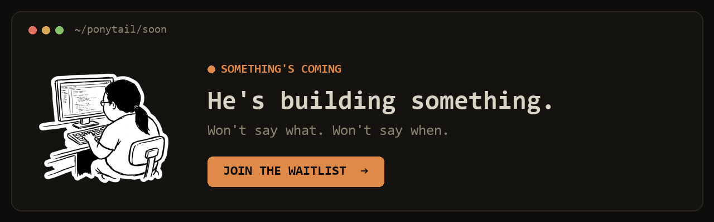

<p align="center">
  <picture>
    <source media="(prefers-color-scheme: dark)" srcset="assets/logo-dark.png">
    
  </picture>
</p>

<h1 align="center">Ponytail（马尾哥）</h1>

<p align="center">
  <em>他什么都不说。他写下一行。它就跑通了。</em>
</p>

<p align="center">
  
  
  
  
  
</p>

<p align="center">
  <a href="https://trendshift.io/repositories/50668" target="_blank" rel="noopener noreferrer"></a>
  <a href="https://trendshift.io/repositories/50668" target="_blank" rel="noopener noreferrer"></a>
</p>

<p align="center">
  <strong>代码量约减少 54%（最高 94%）&middot; 成本约降低 20% &middot; 速度约提升 27% &middot; 100% 安全</strong><br>
  <sub>在真实的 Claude Code 会话中测得——在一个真实的开源仓库（FastAPI + React）上编辑，与不加载该 skill 的同一 agent 对比。约 54% 是 12 个功能任务的平均值（Haiku 4.5，n=4）；在 agent 会过度构建的地方（一个日期选择器）可达 94%，而在代码本已精简的地方几乎为零。ponytail 保留了每一道安全护栏，而一个光秃秃的“写 one-liner”提示词会丢掉其中一道。（早先的单次基准把 80-94% 报成了一个固定数字；相对于一个公平的 agentic 基线，那是每个任务的上限，而非平均值。）<a href="benchmarks/results/2026-06-18-agentic.md">完整说明</a> &middot; <a href="benchmarks/">复现方法</a>。</sub>
</p>

<p align="center">
  <sub>社区翻译。基准且最新的版本是<a href="README.md">英文 README</a>。</sub>
</p>

---

<p align="center">
  <a href="https://ponytail.dev/soon"></a>
</p>

你认识他。长长的马尾辫。椭圆形的眼镜。在公司待的时间比版本控制系统还长。你给他看五十行代码；他看了看，什么都不说，然后用一行把它们替换掉。

Ponytail 把他放进你的 AI agent 里。

## 之前 / 之后

你要一个日期选择器。你的 agent 装上了 flatpickr，写了一个包装组件，加了一个样式表，然后开始讨论时区。

用 ponytail：

```html
<!-- ponytail: browser has one -->
<input type="date">
```

更多被马尾哥救下来的案例见 [examples/](examples/)。

## 数据

诚实的度量方式，是让一个真实的 agent 干真实的活：一个无头（headless）的 Claude Code 会话，编辑 [tiangolo 的 full-stack-fastapi-template](https://github.com/fastapi/full-stack-fastapi-template)（一个真实的 FastAPI + React 仓库），并以它留下的 `git diff` 打分。十二个功能工单，同一个 agent 分别加载和不加载该 skill，n=4，Haiku 4.5。

<p align="center">
  
</p>

| 相对无 skill 基线 | LOC | tokens | 成本 | 时间 | 安全 |
|---|--:|--:|--:|--:|--:|
| **ponytail** | **-54%** | **-22%** | **-20%** | **-27%** | **100%** |
| caveman（简练文风对照组） | -20% | +7% | +3% | +2% | 100% |
| “YAGNI + one-liner”提示词 | -33% | -14% | -21% | -30% | 95% |

ponytail 是唯一一个在每项指标上都有削减的分支，也是唯一一个在削减的同时保持完全安全的分支。削减幅度在存在真实的过度构建陷阱处最大（日期选择器 404 行降到 23 行，颜色选择器 287 行降到 23 行，因为它伸手去拿原生的 `<input>` 而不是一个组件），在本已精简的代码上则几乎为零。完整方法、逐任务表格和局限性：[benchmarks/results/2026-06-18-agentic.md](benchmarks/results/2026-06-18-agentic.md)。

<details>
<summary><strong>更早的单次数据（孤立生成）</strong></summary>

五个日常任务，三个模型，三个分支（无 skill、[caveman](https://github.com/JuliusBrussee/caveman)、ponytail），十次运行，取中位数。一个提示词，一次补全，数答案的行数：

<p align="center">
  
</p>

这显示出**代码量减少 80-94%**。[#126](https://github.com/DietrichGebert/ponytail/issues/126) 中肯地指出，裸模型基线会用散文和各种选项把答案撑长，所以那个差距部分是对话式基线带来的假象。上面的 agentic 数据是修正后、站得住脚的版本。用 `npx promptfoo eval -c benchmarks/promptfooconfig.yaml` 复现单次运行。

</details>

**这条规则从来都不是“最少 token”。** 它是：只写任务需要的东西，绝不砍掉校验、错误处理、安全或可访问性。代码之所以变小，是因为它是必要的，而不是被硬压出来的。更低的成本和延迟，是那些遵循这道阶梯的模型上的副产品；一个花心思在推理 token 上反复权衡各级台阶的简练推理模型，可能会走向反面（在 GPT-5.5 上就是如此）。

## 工作原理

在写代码之前，agent 在第一级站得住脚的台阶上停下：

```
1. 这个需要存在吗？        → 不需要：跳过（YAGNI）
2. 这个代码库里已经有了吗？ → 复用它，别重写
3. 标准库能做吗？          → 用它
4. 有原生平台特性吗？      → 用它
5. 有已安装的依赖能解决吗？ → 用它
6. 能一行搞定吗？          → 就一行
7. 只有到这一步：写能跑通的最少代码
```

这道阶梯是在它*理解了问题之后*才走，而不是用来代替理解：它会读改动触及的代码、追踪真实的流程，然后再选台阶。对解决方案偷懒，对阅读从不偷懒。

懒，但不失职：信任边界的校验、数据丢失的处理、安全和可访问性，永远不在砍的清单上。

## 安装

ponytail 会向你索取的最大工作量：

Claude Code 和 Codex 插件会运行两个极小的 Node.js 生命周期钩子，所以 `node` 需要在你的 PATH 上（Nix/nvm 用户注意：它必须在非交互式 shell 的 PATH 上）。如果不在，skill 仍然能用，只是常驻激活会保持安静，而不是在每个提示词上报错。

### Claude Code

```
/plugin marketplace add DietrichGebert/ponytail
```
```
/plugin install ponytail@ponytail
```
（你得分两次发送提示词，安装才能生效）

桌面应用没有 `/plugin` 命令。改从 UI 安装：Customize，个人插件旁边的 +，Create plugin and add marketplace，Add from repository，然后输入仓库 URL（感谢 @NiklasDHahn，#98）。

### Codex

```bash
codex plugin marketplace add DietrichGebert/ponytail
codex
```

打开 `/plugins`，选择 Ponytail marketplace，安装 Ponytail。然后打开 `/hooks`，审阅并信任它的两个生命周期钩子，再开启一个新会话。

同一次安装也覆盖 Codex 桌面应用：安装后重启应用，它就会加载该插件。

### GitHub Copilot CLI

```bash
copilot plugin marketplace add DietrichGebert/ponytail
copilot plugin install ponytail@ponytail
```

在交互式 Copilot CLI 会话里，使用等价的斜杠命令：

```
/plugin marketplace add DietrichGebert/ponytail
/plugin install ponytail@ponytail
```

Copilot CLI 会按插件名给插件命令加命名空间。例如：

```text
/ponytail:ponytail ultra
/ponytail:ponytail-review
```

### Pi agent harness

```
pi install git:github.com/DietrichGebert/ponytail
```

### OpenCode

加到 `opencode.json`：

```json
{ "plugin": ["@dietrichgebert/ponytail"] }
```

也可以从一个 checkout 运行（插件会复用 `hooks/` 和 `skills/`）：

```json
{ "plugin": ["./.opencode/plugins/ponytail.mjs"] }
```

每一轮都在当前级别注入规则集；并加入 `/ponytail` 命令（见 [命令](#命令)）。OpenCode 也会自动加载本仓库的 `AGENTS.md`，所以即使没有插件，规则也依然生效。插件额外提供 `lite/full/ultra/off` 各级别。

`./` 路径是相对于你项目的 `opencode.json` 解析的；若要在多个项目间共享同一个 checkout，请把它指向 `.mjs` 的绝对路径（它会相对于自身文件找到自己的 `hooks/` 和 `skills/`）。

### Gemini CLI

```bash
gemini extensions install https://github.com/DietrichGebert/ponytail
```

每个会话都把规则集作为常驻上下文加载，并注册 `/ponytail` 命令；`skills/` 也一并附带，在任务需要时激活。
Gemini 适配器故意不附带根目录的 `hooks/hooks.json`：Gemini 会自动加载那个路径，而 Ponytail 的生命周期钩子用的是 Claude/Codex 的事件名。

### Antigravity CLI

Google 正在把 Gemini CLI 更名为 Antigravity CLI（`agy` 二进制）；同一个扩展在那里也能安装：

```bash
agy plugin install https://github.com/DietrichGebert/ponytail
```

它复用本仓库的 `gemini-extension.json`。有一处不同：Antigravity 会把 `/ponytail` 命令转成 skill，所以你要把它们敲进聊天里（例如把 `/ponytail-review` 当成一条消息发送），而不是从斜杠菜单里选。在迁移完成之前（大约 2026 年 6 月 18 日），`gemini extensions install` 也仍然有效。若想把它作为常驻规则运行，把规则集放进 `.agents/rules/`。

### Hermes Agent

```bash
hermes plugins install DietrichGebert/ponytail --enable
```

安装后重启 Hermes。该插件会在每一轮 LLM 之前注入当前的 Ponytail 模式，把附带的 skill 注册为 `ponytail:<skill>`，并加入 `/ponytail`、`/ponytail-review`、`/ponytail-audit`、`/ponytail-debt`、`/ponytail-gain` 和 `/ponytail-help`。在共享网关里，用 Hermes 的斜杠命令访问控制把 `/ponytail` 限制给受信任的用户；运行时模式是进程本地的。

### CodeWhale

从项目根目录读取 `AGENTS.md`，零配置。把 [`AGENTS.md`](AGENTS.md) 复制到你的项目，或者从本仓库的 checkout 里运行 `codewhale`。就这样。

### Swival

先把这套集合暂存到你的 library，再加入你想要的 skill：

```bash
swival skills add --global https://github.com/DietrichGebert/ponytail  # 暂存进 ~/.config/swival/library
swival skills add ponytail                                             # 把这套集合装进本项目
swival skills add --global ponytail                                    # 或在每个项目里都激活它
```

Swival 也会从项目根目录读取 `AGENTS.md`，并从全局的 `~/.config/swival/AGENTS.md` 读取，这是仅指令的兜底方式。

在命令行里，用 `$` 前缀显式激活一个 skill。例如：`$ponytail-review`。

### Devin CLI

```bash
devin plugins install DietrichGebert/ponytail
```

把 ponytail 作为 Devin 插件安装；skill 以 `/ponytail:ponytail`、`/ponytail:ponytail-review` 等形式提供。

### OpenClaw

```bash
clawhub install ponytail
```

从 ClawHub 把 ponytail 作为 OpenClaw skill 安装；review、audit、debt、gain 和 help 这几个 skill 也以同样方式安装（`clawhub install ponytail-review`，以此类推）。OpenClaw 会在编码任务上应用它，也把它作为 `/ponytail` 命令暴露出来。没有 ClawHub 的话，把 [`.openclaw/skills/ponytail`](.openclaw/skills/) 复制进 `~/.openclaw/skills/`。

就这样。他会为此骄傲。他不会说出来。

每个会话都激活，配一小把命令（见 [命令](#命令)）。`/ponytail ultra` 就是为代码库把你个人得罪了的时候准备的。启动和模式切换的文字会显示当前模式。

用环境变量 `PONYTAIL_DEFAULT_MODE`（`lite`/`full`/`ultra`/`off`）为每个新会话设置级别，或者在 `~/.config/ponytail/config.json`（Windows 上是 `%APPDATA%\ponytail\config.json`）里用 `defaultMode` 字段。默认是 `full`。

Cursor、Windsurf、Cline、GitHub Copilot（编辑器）、Aider、Kiro、Zed、CodeWhale、Swival：从本仓库复制相应的规则文件（[`.cursor/rules/`](.cursor/rules/)、[`.windsurf/rules/`](.windsurf/rules/)、[`.clinerules/`](.clinerules/)、[`.github/copilot-instructions.md`](.github/copilot-instructions.md)、[`AGENTS.md`](AGENTS.md)、[`.kiro/steering/`](.kiro/steering/)）。

Kiro：把 `.kiro/steering/ponytail.md` 复制到 `~/.kiro/steering/`（全局）或你项目里的 `.kiro/steering/`。

GitHub Copilot CLI 兜底（仅指令模式）：它会读取项目里的 `AGENTS.md` 和 `.github/copilot-instructions.md`，或者把规则复制进 `~/.copilot/copilot-instructions.md`，就能在每个项目里运行 ponytail。这条路径保留常驻指引，但不会加入插件的模式切换或钩子。

装了 Codex 扩展的 VS Code 会读取 `AGENTS.md`，本仓库自带该文件，所以从仓库根目录开箱即用，无需配置（`~/.codex/AGENTS.md` 能让 Codex 全局生效）。

哪些文件对应哪个 agent：[Agent 可移植性](docs/agent-portability.md)。

### 卸载

| 宿主 | 命令 |
|------|---------|
| Claude Code | `/plugin remove ponytail` |
| Codex | `codex plugin remove ponytail` |
| Devin CLI | `devin plugins remove ponytail` |
| Pi agent | `pi uninstall ponytail` |
| Cursor / Windsurf / Cline / 等 | 删掉复制过来的规则文件 |

这些会移除插件自己的文件。它们会留下少量 ponytail 写在插件文件夹之外的状态：模式标志、`~/.config/ponytail/config.json`，以及（如果你接受了那次设置提示）`~/.claude/settings.json` 里的一条 `statusLine` 记录。运行 `node scripts/uninstall.js` 也把这些清理掉。**要在上面的宿主移除命令之前运行它**——因为脚本本身就是一个插件文件，先移除插件会把它一起删掉（或者从本仓库的另一个克隆里运行它）。只有当 statusLine 指向 ponytail 自己的脚本时它才会移除，所以你自己设置的 statusline 不会被动。

## 命令

| 命令 | 作用 |
|---------|--------------|
| `/ponytail [lite \| full \| ultra \| off]` | 设置强度，或关闭它。不带参数时报告当前级别。 |
| `/ponytail-review` | 审查当前的 diff 是否过度工程，返回一份删除清单。 |
| `/ponytail-audit` | 审计整个仓库的过度工程，而不仅是 diff。 |
| `/ponytail-debt` | 把你搁置的那些 `ponytail:` 快捷做法收进一本账里，好让“以后”不至于变成“永远不”。 |
| `/ponytail-gain` | 展示来自基准的实测影响记分板（更少代码、更少成本、更快速度）。 |
| `/ponytail-help` | 上述命令的快速参考。 |

命令需要一个支持 skill 的宿主（Claude Code、Codex、Devin CLI、OpenCode、Gemini、pi、Swival、Hermes Agent）。在 Codex 里它们是 skill，用 `@` 调用（`@ponytail-review`）。仅指令的适配器（Cursor、Windsurf、Cline、Copilot、Kiro、Antigravity）会加载常驻规则集，但不带这些命令。

## 开发

改动那段精简的规则文本时，让各 agent 的副本保持一致：

```bash
node scripts/check-rule-copies.js
npm test
```

OpenClaw 的 skill 包（`.openclaw/skills/`）是从 `skills/` 生成的；改动某个 skill 后重跑 `node scripts/build-openclaw-skills.js`，如果它过期了，测试套件会失败。要把 skill 发布到 ClawHub，先运行一次 `clawhub login`，再运行 `node scripts/publish-openclaw-skills.js`（它会按 `package.json` 的版本发布全部六个；加 `--dry-run` 可预览）。

正确性基准会派生 Python 来做 email 和 CSV 检查；会先尝试 `python3` 再尝试 `python`。CSV 检查需要本地装有 `pandas`。

## 常见问题

**它需要配置文件吗？**
不需要。一个可选的 `~/.config/ponytail/config.json` 或 `PONYTAIL_DEFAULT_MODE` 环境变量可以设置默认级别，但没有任何东西是必需的。

**要是我真的需要那个 120 行的缓存类呢？**
你不需要。你要是硬要，他也会给你建。慢慢地。正确地。一边看着你。

**它能扩展（scale）吗？**
你从没写过的代码可以无限扩展。零 bug，零 CVE，从古至今 100% 正常运行。

**为什么叫“ponytail（马尾辫）”？**
你心里清楚为什么。

## 赞助方

<p align="center">
  <a href="https://greenpt.com/">
    <picture>
      <source media="(prefers-color-scheme: dark)" srcset="assets/logo-greenpt-dark.svg">
      
    </picture>
  </a>
</p>

## 许可证

[MIT](LICENSE)。能用的最短许可证。

## Star 历史

<a href="https://www.star-history.com/dietrichgebert/ponytail#history">
 <picture>
   <source media="(prefers-color-scheme: dark)" srcset="https://api.star-history.com/chart?repos=DietrichGebert/ponytail&type=Date&theme=dark" />
   <source media="(prefers-color-scheme: light)" srcset="https://api.star-history.com/chart?repos=DietrichGebert/ponytail&type=Date" />
   
 </picture>
</a>
